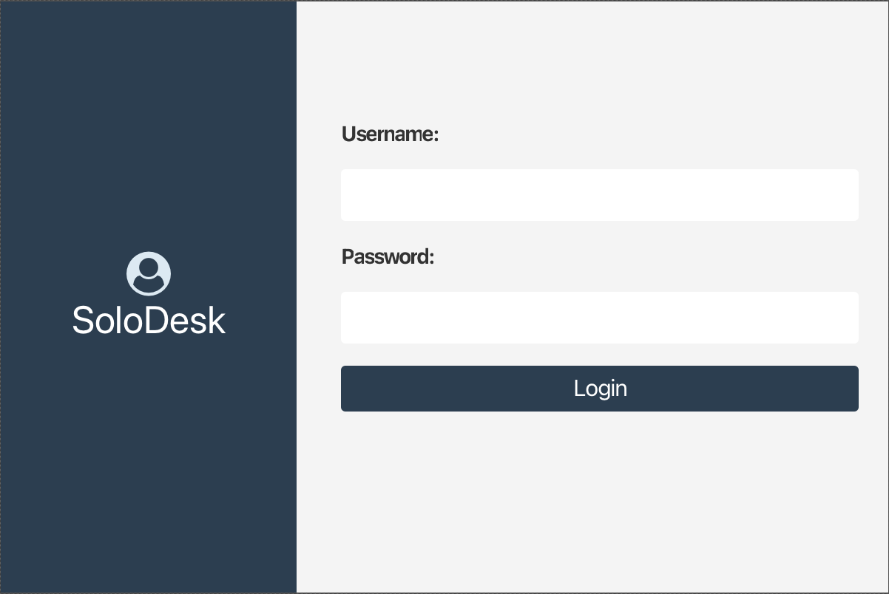
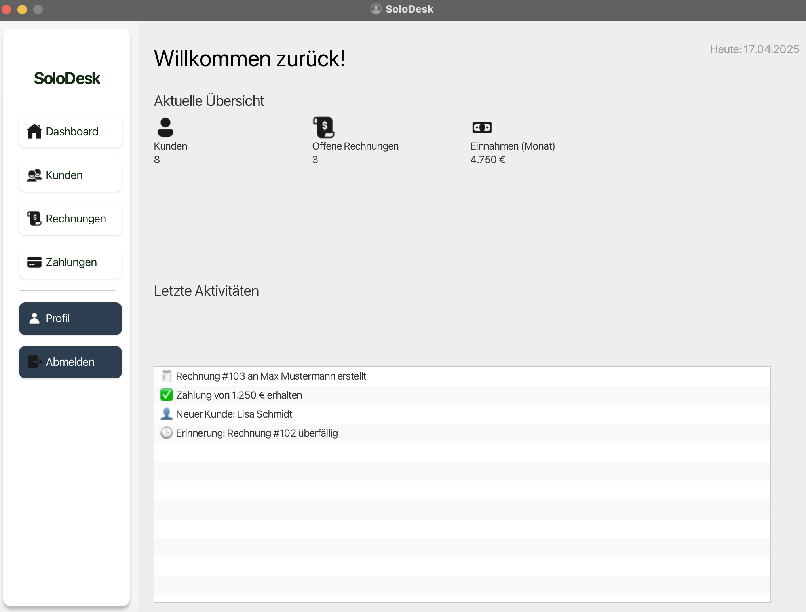
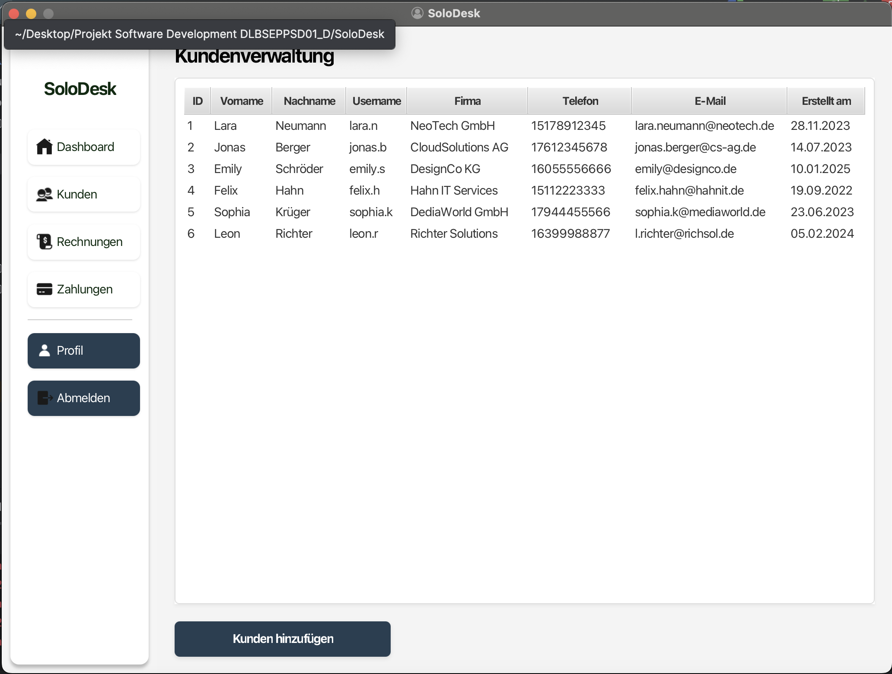

# SoloDesk – Customer and Invoice Management (JavaFX)

SoloDesk is a desktop application developed with **JavaFX** for managing clients, invoices and payments.

The application was created as part of a university software development project and demonstrates the development of a modular desktop application using **Java, JavaFX and SQLite**.

---

# Features

• Login system with SQLite authentication  
• Dashboard with statistics overview  
• Customer management (create, edit, delete)  
• Invoice management  
• Payment tracking  
• Local SQLite database storage  
• Modular JavaFX architecture using FXML and CSS  

---

# Screenshots

## Login



Login screen with authentication against the SQLite database.

---

## Main Dashboard



Overview of the main application interface and navigation.

---

## Customer Management



Management interface for creating and editing customer records.

---

# Technologies

Java 17  
JavaFX 23  
SQLite  
Maven  
JUnit  

---

# Project Structure

```
src/
├── main
│ ├── java/com/warda/solodesk
│ │ ├── controllers
│ │ ├── models
│ │ └── services
│ │
│ └── resources
│ ├── fxml
│ ├── images
│ └── styles
│
├── test
│
pom.xml
solodesk.db

```

---

# Running the Application

### Build the project

mvn clean install

### Run the application


---

# Example Login

Username
admin


Password
123456


---

# Author

Andreas Warda  
Software Engineering (B.Sc.)  
IU International University

---

# License

This project is licensed under the MIT License.

The software may be used, modified and distributed freely as long as the original author is credited.
